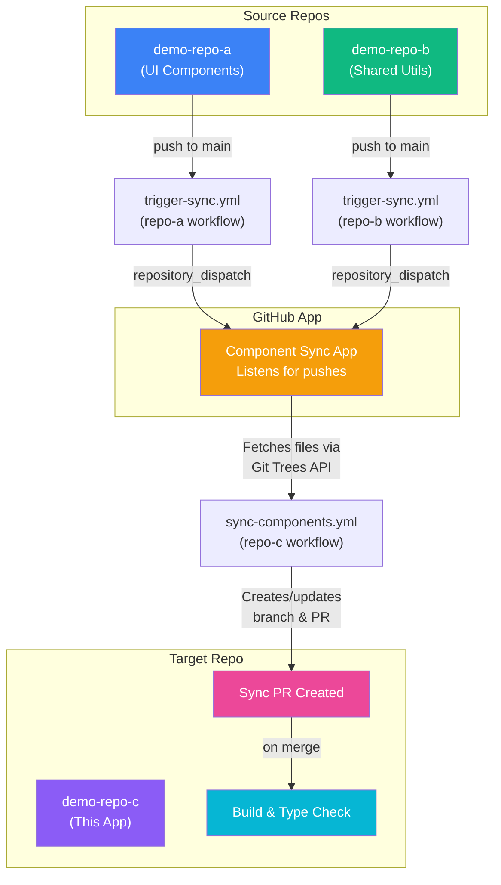
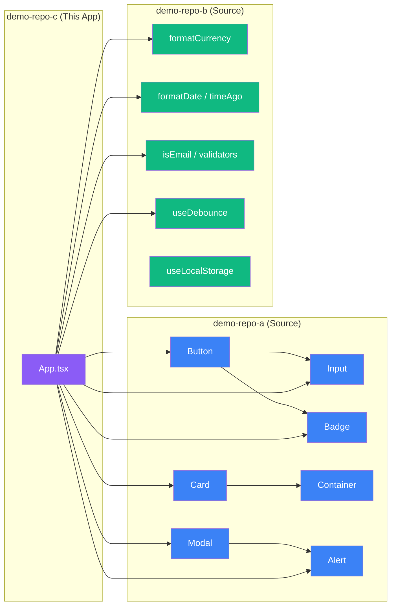

# Demo App (demo-repo-c)

A React application that consumes **UI components** from `demo-repo-a` and **shared utilities** from `demo-repo-b`, automatically synced via the [Component Sync GitHub App](https://github.com/GitHubDemoPlayground/GitHubApp).

## How It Works



## Architecture



## Project Structure

```
demo-repo-c/
├── src/
│   ├── App.tsx              # Main application (imports synced components)
│   ├── index.tsx            # Entry point
│   └── pages/               # App pages
├── components/              # ← Auto-synced by GitHub App
│   ├── repo-a/              # UI components from demo-repo-a
│   │   ├── ui/
│   │   │   ├── Button.tsx
│   │   │   ├── Input.tsx
│   │   │   └── Badge.tsx
│   │   ├── layout/
│   │   │   ├── Card.tsx
│   │   │   └── Container.tsx
│   │   ├── feedback/
│   │   │   ├── Modal.tsx
│   │   │   └── Alert.tsx
│   │   └── index.ts         # Barrel exports
│   └── repo-b/              # Shared utils from demo-repo-b
│       ├── formatters/
│       │   ├── currency.ts
│       │   ├── date.ts
│       │   └── number.ts
│       ├── validators/
│       │   ├── string.ts
│       │   └── form.ts
│       ├── hooks/
│       │   ├── useDebounce.ts
│       │   └── useLocalStorage.ts
│       └── index.ts         # Barrel exports
├── .github/
│   └── workflows/
│       └── sync-components.yml  # Sync + Build pipeline
├── package.json
├── tsconfig.json
└── README.md
```

## Synced Components

### From `demo-repo-a` → `components/repo-a/`

| Component | Type | Description |
|-----------|------|-------------|
| `Button` | UI | Multi-variant button (primary, secondary, danger, ghost) with loading state |
| `Input` | UI | Form input with label, validation error, and helper text |
| `Badge` | UI | Colored status badges (success, warning, error, info) |
| `Card` | Layout | Content card with optional title, subtitle, and footer |
| `Container` | Layout | Responsive max-width wrapper |
| `Modal` | Feedback | Accessible dialog with backdrop and ESC-to-close |
| `Alert` | Feedback | Dismissible notification banners |

### From `demo-repo-b` → `components/repo-b/`

| Export | Category | Description |
|--------|----------|-------------|
| `formatCurrency` | Formatter | Locale-aware currency formatting |
| `formatDate`, `timeAgo` | Formatter | Date display and relative timestamps |
| `formatCompact` | Formatter | Number abbreviation (48.2K, 1.2M) |
| `isEmail`, `isUrl` | Validator | String format validation |
| `validateField`, `required` | Validator | Composable form validation |
| `useDebounce` | Hook | Debounced value for search/filter |
| `useLocalStorage` | Hook | Persistent state via localStorage |

## Workflow

The sync pipeline runs automatically when source repos push to `main`:

1. **Source repo** pushes to `main` → `trigger-sync.yml` fires
2. **Repository dispatch** sends `component-sync` event to this repo
3. **Sync workflow** runs the Component Sync Action:
   - Authenticates as the GitHub App
   - Fetches directory trees from source repos via Git Trees API
   - Creates a sync branch with updated files
   - Opens (or updates) a PR with the changes
4. **Build job** runs type-checking to verify the synced code compiles
5. **Review & Merge** the PR to integrate the updated components

## Development

```bash
# Install dependencies
npm install

# Type check
npm run typecheck

# Run dev server
npm run dev
```
